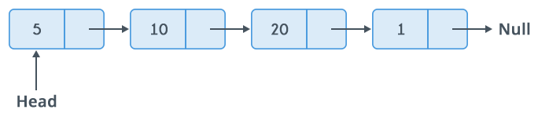
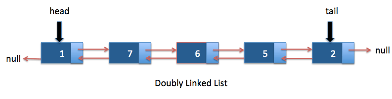

# Linked List Data Structure

A linked list is a linear data structure, in which the elements are not stored at contiguous memory locations. The elements in a linked list are linked using pointers as shown in the image above.

Each element in a linked list is stored in the form of a node.

A node is a collection of two sub-elements or parts. A data part that stores the element and a next part that stores the link to the next node.

The first node is always used as a reference to traverse the list and is called <strong>head</strong>. The last node points to NULL.

In language C, a linked list node can be implemented as follows:

```
  struct Node {
    int data;
    struct Node* next;
  };
```

### Types of Linked list

- Singly-Linked list
- Doubly-Linked list
- Circular-Linked list

### Singly Linked list

A singly linked list is collection of nodes wherein each node has 2 parts: data and a pointer to the next node. The list terminates with a node pointing at NULL.

<p align="center">
  
</p>

### Doubly Linked list

<p align="center">
  
</p>

The only difference between the singly linked list and the doubly linked list is that each node contains three fields: two link fields (references to the previous and next nodes in the sequence of nodes) and a data field.

### Circular Linked list

TODO

## Refenrences

https://www.geeksforgeeks.org/data-structures/linked-list/

https://medium.com/@1991dharapatel/singly-linked-list-in-javascript-aafc71e0cf73

https://www.java2novice.com/data-structures-in-java/linked-list/singly-linked-list/

https://www.hackerearth.com/pt-br/practice/data-structures/linked-list/singly-linked-list/tutorial/

https://sites.google.com/site/merasemester/data-structures/linked-list

https://cooervo.github.io/Algorithms-DataStructures-BigONotation/index.html

https://java2blog.com/doubly-linked-list-java/

https://www.geeksforgeeks.org/doubly-linked-list/

https://www.tutorialspoint.com/data_structures_algorithms/doubly_linked_list_algorithm.htm