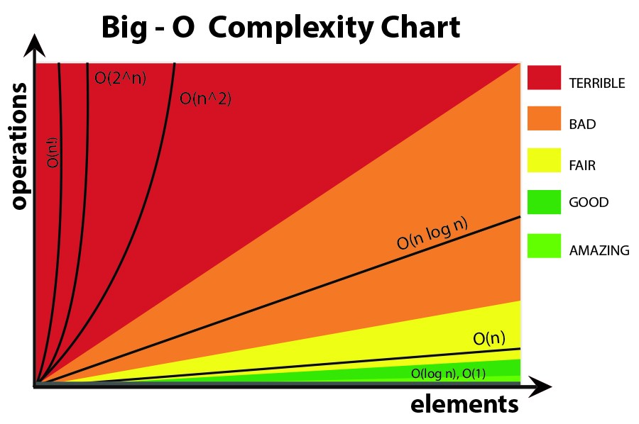

# Big-O Notation

<p align="center">
  
</p>

Big O notation is a mathematical notation that describes the limiting behavior of a function when the argument tends towards a particular value or infinity. Big O notation is the language we use for talking about how long an algorithm takes to run. It's how we compare the efficiency of different approaches to a problem.

<br/>
<br/>

## Let's break that down:

<strong>1 - how quickly the runtime grows</strong> — It's hard to pin down the exact runtime of an algorithm. It depends on the speed of the processor, what else the computer is running, etc. So instead of talking about the runtime directly, we use big O notation to talk about how quickly the runtime grows.

<strong>2 - relative to the input</strong> — If we were measuring our runtime directly, we could express our speed in seconds. Since we're measuring how quickly our runtime grows, we need to express our speed in terms of...something else. With Big O notation, we use the size of the input, which we call "nn." So we can say things like the runtime grows "on the order of the size of the input" (O(n)) or "on the order of the square of the size of the input" (O(n^2)).

<strong>3 - as the input gets arbitrarily large</strong> — Our algorithm may have steps that seem expensive when nn is small but are eclipsed eventually by other steps as nn gets huge. For big O analysis, we care most about the stuff that grows fastest as the input grows, because everything else is quickly eclipsed as nn gets very large. (If you know what an asymptote is, you might see why "big O analysis" is sometimes called "asymptotic analysis.")

<br/>
<br/>

## Some examples:

```c
  void printFirstItem(const int* items) {
    printf("%d\n", items[0]);
  }
```

<strong>This function runs in O(1) time (or "constant time") relative to its input.</strong> The input list could be 1 item or 1,000 items, but this function would still just require one "step."

```c
  void printAllItems(const int* items, size_t size) {
    for (int i = 0; i < size; i++) {
      printf("%d\n", items[i]);
    }
  }
```

<strong>This function runs in O(n) time (or "linear time"), where nn is the number of items in the list.</strong> If the list has 10 items, we have to print 10 times. If it has 1,000 items, we have to print 1,000 times.

```c
  void printAllPossibleOrderedPairs(const int* items, size_t size) {
    size_t i, j;
    for (i = 0; i < size; i++) {
      for (j = 0; j < size; j++) {
        printf("%d, &d\n", items[i], items[j]);
      }
    }
  }
```

Here we're nesting two loops. If our list has nn items, our outer loop runs nn times and our inner loop runs nn times for each iteration of the outer loop, giving us n^2 total prints. Thus this function runs in O(n^2) time (or "quadratic time"). If the list has 10 items, we have to print 100 times. If it has 1,000 items, we have to print 1,000,000 times.

## References

https://en.wikipedia.org/wiki/Time_complexity

https://www.youtube.com/watch?v=KVlGx-9CuO4&list=PL5TJqBvpXQv5Bb71AE5Cd_kB5rNsfU4Cp&index=2

https://www.khanacademy.org/computing/computer-science/algorithms/asymptotic-notation/a/asymptotic-notation

https://www.educative.io/blog/a-big-o-primer-for-beginning-devs

https://www.tutorialspoint.com/data_structures_algorithms/asymptotic_analysis.htm

https://www.geeksforgeeks.org/analysis-of-algorithms-set-1-asymptotic-analysis/

https://www.geeksforgeeks.org/analysis-of-algorithms-set-2-asymptotic-analysis/

https://www.interviewcake.com/article/python/big-o-notation-time-and-space-complexity?course=dsa

https://www.youtube.com/watch?v=g2o22C3CRfU