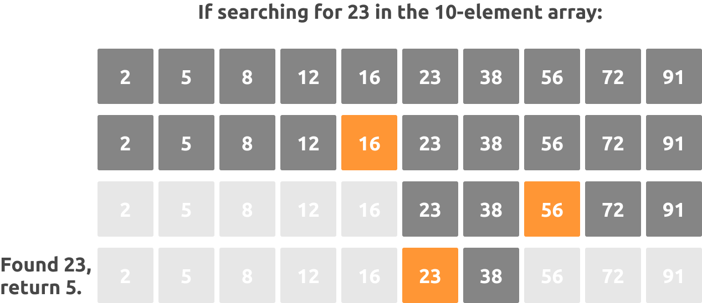

# Binary Search

<p align="center">
  
</p>

Binary search is a search algorithm that finds the position of a target value within a sorted array. Search algorithm works on the principle of divide and conquer. For this algorithm to work properly, the data collection should be in the sorted form.

The idea of binary search is to use the information that the array is sorted and reduce the time complexity to O(Log n).

### Implementation of a birary search in C:

```bash
  int binarySearch(int array[], int length, int target) 
{
  int rightPoint = length - 1;
  int leftPoint = 0;
  int middlePosition = (leftPoint + rightPoint) / 2;
  
  while (length > middlePosition) 
  {
    int middleElement = array[middlePosition];
  ...
```

- [See Full Code](binary-search.c)

## Big-O

### Worst-case

#### O(log n)

### Best-case

#### O(1)

## References

https://en.wikipedia.org/wiki/Binary_search_algorithm

https://www.geeksforgeeks.org/binary-search/

https://www.tutorialspoint.com/data_structures_algorithms/binary_search_algorithm.htm

https://stackoverflow.com/questions/34280619/big-o-notation-linear-and-binary-search